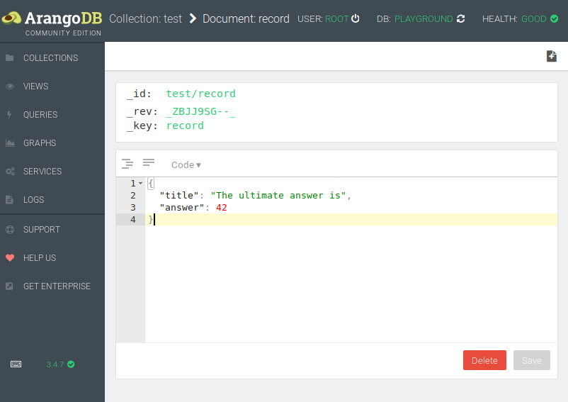

# About

A showcase of VelocyJack failing ArangoDB Java asynchronous driver
authentication.

## Goal

Achieve native Kotlin data classes support  

## Problem

Once [VelocyJack](https://github.com/arangodb/jackson-dataformat-velocypack#velocypack-dataformat-for-jackson)
is set using deprecated method [setSerializer](https://github.com/arangodb/arangodb-java-driver-async/blob/0614158fee5c38875faafbb20d932b72af7dba7f/src/main/java/com/arangodb/ArangoDBAsync.java#L507)
driver fails to connect to the database.

## Prerequisites

A basic ArangoDB installation with one sample document

Example:

```json
{
  "_key": "record",
  "_id": "test/record",
  "_rev": "_ZBJJ9SG--_",
  "title": "The ultimate answer is",
  "answer": 42
}
``` 

Example data:
 
 

## Acknowledgments
 

* A StackOverflow [answer](https://stackoverflow.com/a/51154551/7598113)
  that suggested a solution to a previous related
  [problem](https://stackoverflow.com/q/51126054/7598113)
* Jackson VelocyPack format support
  [repo](https://github.com/arangodb/jackson-dataformat-velocypack#velocypack-dataformat-for-jackson)
* Jackson module for Kotlin
  [repo](https://github.com/FasterXML/jackson-module-kotlin#overview)
* Kotlin JDK 8 coroutines integration
  [repo](https://github.com/Kotlin/kotlinx.coroutines/blob/master/integration/kotlinx-coroutines-jdk8/README.md) 